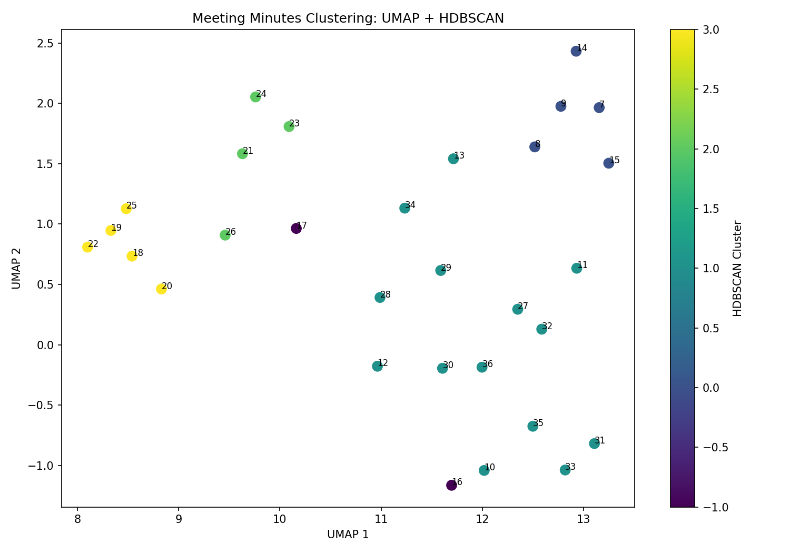
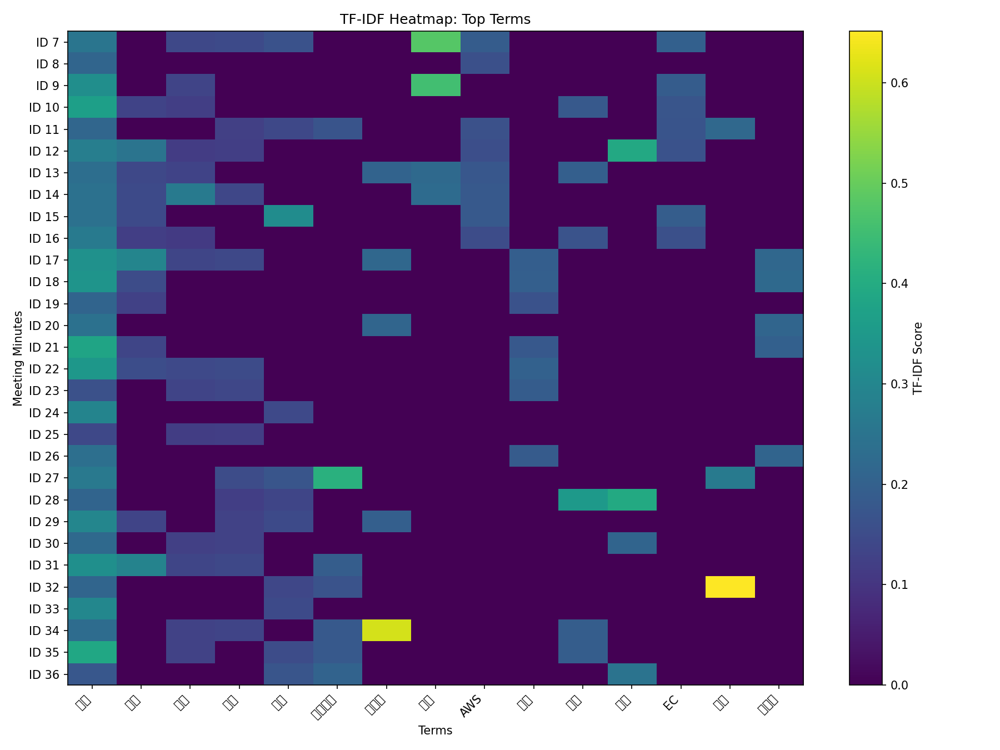

# Meeting Minutes Analytics on AWS

AWS上に構築したPostgreSQLデータベースから日本語の議事録データを取得し、Pythonで自然言語処理・TF-IDF分析・クラスタリング・可視化を行うクラウドデータ分析ポートフォリオです。

## Overview

このプロジェクトでは、AWS RDS for PostgreSQLに保存された日本語議事録をEC2上のPythonアプリケーションから取得し、以下の分析を実行します。

1. RDS PostgreSQLから議事録データを取得
2. SudachiPyによる日本語形態素解析
3. TF-IDFによる特徴量生成
4. UMAPによる2次元への次元削減
5. HDBSCANによる教師なしクラスタリング
6. クラスタごとの重要語抽出
7. 分析結果の可視化

## Architecture

```text
Local Windows / VS Code
        |
        | Git push
        v
      GitHub
        |
        | Git pull
        v
     AWS EC2
        |
        | Python / psycopg2
        | SSL connection
        v
AWS RDS for PostgreSQL
        |
        | Meeting minutes
        v
    SudachiPy
        |
        v
      TF-IDF
        |
        v
       UMAP
        |
        v
     HDBSCAN
        |
        +--> Cluster analysis
        |
        +--> TF-IDF heatmap
        |
        +--> UMAP visualization
```

## AWS Architecture

- **Amazon EC2**
  - Python分析処理を実行

- **Amazon RDS for PostgreSQL**
  - 議事録データを保存
  - Private Subnetに配置

- **Amazon VPC**
  - Public Subnet: EC2
  - Private Subnets: RDS

- **Security Groups**
  - PostgreSQL通信をEC2からRDSへのTCP/5432に制限

- **AWS Systems Manager**
  - EC2の管理・トラブルシューティングに利用

- **IAM Role**
  - EC2からSystems Managerを利用するための権限を付与

## Technologies

| Category | Technology |
|---|---|
| Cloud | AWS |
| Compute | Amazon EC2 |
| Database | Amazon RDS for PostgreSQL |
| Network | Amazon VPC |
| Server Management | AWS Systems Manager |
| Language | Python |
| Database Client | psycopg2 |
| Japanese NLP | SudachiPy |
| Feature Extraction | TF-IDF |
| Dimensionality Reduction | UMAP |
| Clustering | HDBSCAN |
| Machine Learning | scikit-learn |
| Visualization | Matplotlib |
| Version Control | Git / GitHub |

## Dataset

検証用として30件の日本語議事録をRDS PostgreSQLに登録しました。

議事録は以下のテーマを含みます。

- AWS / インフラ
- AI / データ分析
- セキュリティ

分析処理ではRDSからデータを直接取得します。

## Analysis Pipeline

```text
PostgreSQL
    |
    v
Japanese Meeting Minutes
    |
    v
SudachiPy
    |
    v
Tokenization / Morphological Analysis
    |
    v
TF-IDF
    |
    v
212-dimensional feature space
    |
    v
UMAP
    |
    v
2-dimensional representation
    |
    v
HDBSCAN
    |
    v
Unsupervised clustering
    |
    v
Visualization
```

今回の実行では、30件の議事録から212個のTF-IDF特徴量が生成されました。

## Results

### UMAP + HDBSCAN



TF-IDFで生成した特徴量をUMAPで2次元化し、HDBSCANによる教師なしクラスタリングを実行しました。

人手で設定したカテゴリをクラスタリング処理には使用せず、文章中の特徴量をもとに自動的にグループ化しています。

### TF-IDF Heatmap



各議事録における主要語のTF-IDFスコアをヒートマップとして可視化しています。

## Evaluation

参考値として、人手で設定したカテゴリとクラスタリング結果を比較しました。

| Metric | Result |
|---|---:|
| Adjusted Rand Index (ARI) | 0.4493 |
| Normalized Mutual Information (NMI) | 0.6184 |

本プロジェクトの主目的はクラスタリング精度の最適化ではなく、AWS上のデータベースから日本語データを取得し、NLP・機械学習・可視化までを一連の処理として実装することです。

## Security Design

データベースの認証情報はソースコードへ直接記述していません。

EC2では環境変数を利用してデータベース接続情報を管理し、`.env` はGitの管理対象外としています。

RDSはPrivate Subnetに配置し、PostgreSQLへのアクセスをEC2からの通信に制限しています。

データベース接続ではSSLを使用しています。

## Repository Structure

```text
minutes-analytics/
├── src/
│   └── analysis.py
├── output/
│   ├── analysis_result.txt
│   ├── tfidf_heatmap.png
│   └── umap_clusters.png
├── .env.example
├── .gitignore
├── README.md
└── requirements.txt
```

## Run

### 1. Install dependencies

```bash
python3 -m pip install --user -r requirements.txt
```

### 2. Configure environment variables

`.env.example` を参考に `.env` を作成します。

```text
DB_HOST=your-rds-endpoint
DB_PORT=5432
DB_NAME=minutesdb
DB_USER=your-db-user
DB_PASSWORD=your-db-password
```

> `.env` はGitの管理対象外です。実際の認証情報をGitHubへ公開しないでください。

### 3. Run analysis

```bash
python3 src/analysis.py
```

分析結果は `output/` ディレクトリへ保存されます。

## What I Learned

このプロジェクトを通じて以下を実践しました。

- AWS VPC / Subnet / Route Table / Internet Gatewayの構築
- EC2とRDS PostgreSQLの接続
- Security Groupによるアクセス制御
- IAM RoleとSystems ManagerによるEC2管理
- PostgreSQLのデータベース・テーブル操作
- PythonからRDSへのSSL接続
- Git / GitHubを利用したソースコード管理
- SudachiPyによる日本語形態素解析
- TF-IDFによる文章特徴量生成
- UMAP / HDBSCANによる教師なし分析
- Matplotlibによる分析結果の可視化
- Linux環境でのPythonパッケージ・ビルドトラブルシューティング

## Future Improvements

- AWS Systems Manager Parameter Store / Secrets Managerによる認証情報管理
- GitHub Actions + AWS IAM OIDCによるCI/CD
- CloudWatchによるEC2監視
- 分析対象データの拡張
- 分析処理の自動実行
