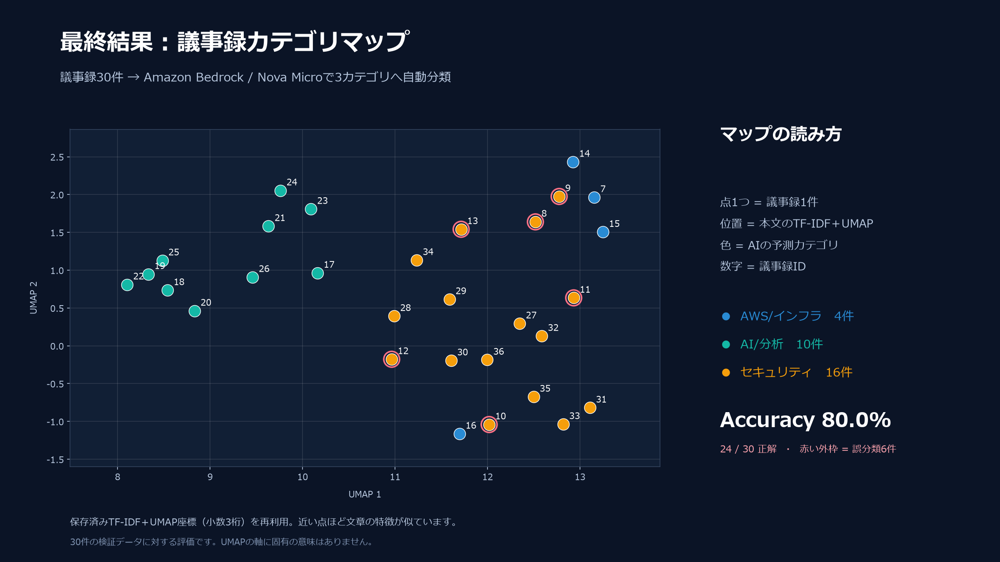

# AWS議事録分析・生成AI自動分類システム

**AWS × Amazon Bedrock × PostgreSQL × Python**

Amazon RDS for PostgreSQLに保存した日本語議事録を、Amazon Bedrockの生成AIモデル「Amazon Nova Micro」で自動分類し、TF-IDFとUMAPで可視化したクラウド・AIエンジニアリングのポートフォリオです。

## 1. プロジェクト概要

AWSインフラの構築、プライベートデータベースへの接続、生成AIによる分類、Pythonでの可視化、精度評価までを実装・検証しました。

本プロジェクトでは**架空の日本語議事録30件**を使用しており、実際の顧客情報や社内の機密議事録は含みません。

### 主な実装内容

- Amazon RDS for PostgreSQLによる議事録データ管理
- AWS Systems ManagerによるプライベートRDSへの接続
- Amazon Bedrock（Nova Micro）による議事録の自動分類
- Pythonとboto3による生成AI API連携
- 分類結果のPostgreSQLへの保存
- TF-IDFとUMAPによる日本語議事録の可視化
- AI分類精度の評価

## 2. システム構成

```text
Windows 11 / Visual Studio Code
               |
               | AWS CLI / SSM
               | ポートフォワーディング
               v
          Amazon EC2
          (SSM管理対象)
               |
               v
     Amazon RDS PostgreSQL
        meeting_minutes
               |
               | Python / psycopg2
               v
        議事録30件を取得
               |
               v
         Amazon Bedrock
         Amazon Nova Micro
               |
               v
       3カテゴリへ自動分類
               |
               v
      RDSのai_categoryへ保存
               |
               v
         TF-IDF + UMAP
               |
               v
        議事録カテゴリマップ
               |
               v
         分類精度の評価
```

開発、Pythonの実行、可視化、GitHubへの公開はWindows 11のVS Codeから行いました。

EC2はプライベートRDSへの接続経路として使用し、Pythonの分析処理はローカル環境で実行しています。

Amazon BedrockへのAPI呼び出しも、ローカルPythonからboto3を使用して行っています。

## 3. 使用技術

| 分野 | 使用技術 | 用途 |
|---|---|---|
| クラウド | AWS | インフラ基盤 |
| コンピューティング | Amazon EC2 | SSM接続の中継 |
| データベース | Amazon RDS for PostgreSQL | 議事録と分類結果の保存 |
| 生成AI | Amazon Bedrock | AI推論サービス |
| AIモデル | Amazon Nova Micro | 議事録の自動分類 |
| セキュリティ | AWS IAM | アクセス権限管理 |
| 運用 | AWS Systems Manager | プライベート接続 |
| プログラミング | Python | データ処理と自動化 |
| AWS SDK | boto3 | Bedrock API連携 |
| DB接続 | psycopg2 | PostgreSQL操作 |
| 日本語処理 | SudachiPy | 形態素解析 |
| 特徴量抽出 | TF-IDF | 文章のベクトル化 |
| 次元削減 | UMAP | 文章の2次元配置 |
| 可視化 | Matplotlib / SciPy | 散布図と密度分布 |

## 4. 議事録の自動分類

### 使用データ

架空の日本語議事録30件をAmazon RDS for PostgreSQLの `meeting_minutes` テーブルに保存し、分析対象としました。

### 分類カテゴリ

| カテゴリ | 主な内容 |
|---|---|
| AWS/インフラ | VPC、EC2、RDS、Terraform、S3、CloudWatch |
| AI/分析 | LLM、RAG、Python、TF-IDF、UMAP、Embedding |
| セキュリティ | IAM、KMS、CloudTrail、WAF、GuardDuty |

### 分類処理

1. RDSから議事録のタイトルと本文を取得
2. Amazon BedrockのConverse APIでNova Microを呼び出す
3. 3カテゴリから最も適切なカテゴリを予測
4. 予測結果をRDSの `ai_category` カラムへ保存
5. 事前に設定した正解カテゴリと比較
6. Accuracy（正解率）を計算
7. TF-IDFとUMAPで議事録の分布を可視化

正解カテゴリは評価に使用し、AIへの分類プロンプトには含めていません。

## 5. 実行結果

Amazon Nova Microによる議事録30件の分類を実施しました。

### 分類精度

| 評価項目 | 結果 |
|---|---|
| 対象データ | 架空の日本語議事録30件 |
| 使用モデル | Amazon Nova Micro |
| 分類カテゴリ | 3種類 |
| 正解件数 | 24件 |
| 誤分類件数 | 6件 |
| **Accuracy（正解率）** | **80.0%** |

### AIの予測カテゴリ別件数

| カテゴリ | 予測件数 |
|---|---:|
| AWS/インフラ | 4件 |
| AI/分析 | 10件 |
| セキュリティ | 16件 |
| **合計** | **30件** |

30件中24件が正しく分類され、6件が誤分類となりました。

予測カテゴリには偏りが見られ、特にセキュリティへの分類が多い結果となりました。

本結果は少数の架空データによる技術検証であり、実運用環境での分類精度を保証するものではありません。

## 6. 議事録カテゴリマップ

TF-IDFとUMAPを使用して、30件の議事録を2次元空間に配置しました。



### マップの読み方

- **点1つ**：議事録1件
- **点の位置**：TF-IDFとUMAPによる文章の特徴
- **点の色**：Amazon Nova Microが予測したカテゴリ
- **数字**：議事録ID
- **赤い外枠**：正解カテゴリとAIの予測が異なる議事録

カテゴリ分類はAmazon Nova Microが実行します。

TF-IDFとUMAPは文章の特徴を可視化するために使用しており、UMAPによって分類カテゴリを決定しているわけではありません。

## 7. 実行環境

- OS：Windows 11
- 開発環境：Visual Studio Code
- ターミナル：PowerShell
- 言語：Python
- AWSリージョン：東京（ap-northeast-1）
- データベース：Amazon RDS for PostgreSQL
- 生成AI：Amazon Bedrock / Amazon Nova Micro

## 8. 実行方法

### 8.1 Pythonライブラリのインストール

```powershell
python -m pip install boto3 psycopg2-binary python-dotenv numpy scipy scikit-learn umap-learn sudachipy sudachidict-core matplotlib
```

### 8.2 接続設定

プロジェクト直下に `.env.local` を作成します。

```dotenv
DB_HOST=127.0.0.1
DB_PORT=15432
DB_NAME=minutesdb
DB_USER=minutesadmin
DB_PASSWORD=YOUR_RDS_PASSWORD
AWS_PROFILE=portfolio-developer
AWS_REGION=ap-northeast-1
```

`.env.local` はGit管理の対象外とし、認証情報をGitHubに公開しません。

### 8.3 SSMポートフォワーディング

VS CodeのPowerShellターミナルで、既存のSSM管理対象EC2を経由してプライベートRDSに接続します。

```powershell
aws ssm start-session `
  --target YOUR_EC2_INSTANCE_ID `
  --document-name AWS-StartPortForwardingSessionToRemoteHost `
  --parameters '{"host":["YOUR_RDS_ENDPOINT"],"portNumber":["5432"],"localPortNumber":["15432"]}' `
  --region ap-northeast-1 `
  --profile portfolio-developer
```

接続を維持したまま、別のVS Code PowerShellターミナルでPythonを実行します。

### 8.4 ダミー議事録の登録

```powershell
python .\src\demo_bedrock_pipeline.py seed
```

### 8.5 Bedrockによる自動分類

```powershell
python .\src\demo_bedrock_pipeline.py classify
```

### 8.6 分類結果の可視化

```powershell
python .\src\demo_bedrock_pipeline.py visualize
```

### 8.7 完成画像の表示

```powershell
Start-Process .\output\bedrock_classification_map.png
```

## 9. プロジェクト構成

```text
minutes-analytics/
├── README.md
├── .gitignore
├── requirements.txt
├── .env.example
├── src/
│   ├── analysis.py
│   ├── bedrock_classifier.py
│   ├── bedrock_clustering.py
│   ├── demo_bedrock_pipeline.py
│   ├── evaluate_bedrock_clustering.py
│   ├── visualize_bedrock_classification.py
│   └── visualize_bedrock_clustering.py
└── output/
    ├── analysis_result.txt
    ├── bedrock_classification_map.png
    ├── bedrock_classification_result.txt
    ├── bedrock_clustering_evaluation.txt
    ├── bedrock_clustering_result.json
    └── bedrock_clustering_result.txt
```

### 今回のメインコード

`src/demo_bedrock_pipeline.py`

このファイルを使用して、ダミー議事録の登録、Amazon Bedrockによる分類、結果の可視化を実行しました。

既存のクラスタリング関連コードは、今回の3カテゴリ分類とは別の実験として管理しています。

## 10. セキュリティ設計

- RDSをプライベートネットワーク内に配置
- AWS Systems Managerを利用した接続
- EC2のSSHポートを公開せずに管理
- IAMによるアクセス権限制御
- データベース認証情報をGit管理から除外
- 実際の社内議事録を使用せず、架空データで検証

## 11. 実践した技術

### AWSインフラ

- Amazon EC2とRDSの連携
- プライベートネットワークへの接続
- IAM権限設定とトラブルシューティング
- Systems Managerによるポートフォワーディング

### 生成AI・Python

- Amazon BedrockのConverse API呼び出し
- boto3によるAWSサービス連携
- 生成AIによる日本語テキスト分類
- PostgreSQLへの予測結果保存
- TF-IDFによる文章特徴量抽出
- UMAPによる次元削減
- Matplotlibによるデータ可視化
- AIモデルの分類精度評価

### 開発・運用

- Windows 11とVS Codeによる開発
- Python仮想環境の利用
- AWS CLIによる操作
- GitとGitHubによるソースコード管理
- エラーログに基づく問題解決

## 12. 今後の改善

- 誤分類6件の原因分析
- 分類プロンプトの改善
- Precision・Recall・F1スコアによる追加評価
- 検証データの拡充
- Pythonコードの自動テスト
- CI/CDの導入

---

**プロジェクト種別：** 個人学習・技術検証ポートフォリオ

**AWSリージョン：** 東京（ap-northeast-1）

**使用データ：** 架空の日本語議事録30件

**分類精度：** Accuracy 80.0%